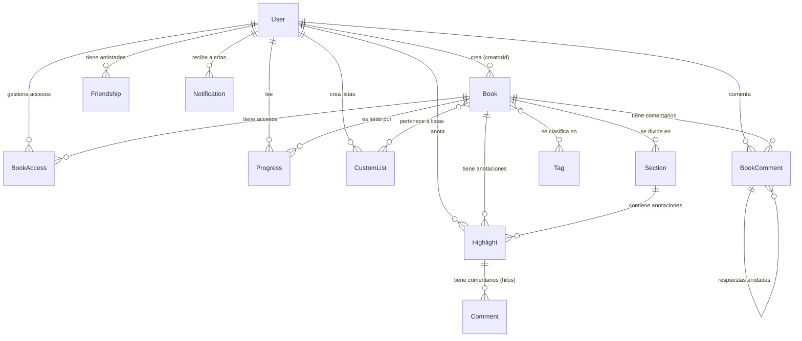

# 📖 Proyectito - Plataforma de Lectura y Comunidad

¡Bienvenido al proyecto! Este documento está diseñado para que cualquier desarrollador o practicante que se integre al equipo pueda entender rápidamente de qué trata la aplicación, qué tecnologías utilizamos, cómo está estructurada y cómo funciona nuestra base de datos.

---

## 🚀 ¿Qué es este proyecto?

Es una **Plataforma Web de Lectura** con fuertes características sociales (comunidad). Los usuarios pueden subir sus propios libros (archivos PDF), leerlos en la plataforma, hacer anotaciones, guardar favoritos, crear listas personalizadas y conectar con amigos para compartir sus lecturas.

### ✨ Funcionalidades Principales
- **Autenticación y Perfiles**: Registro, inicio de sesión, y perfiles personalizables (avatar, portada recortable, biografía).
- **Lector de PDF Avanzado**: Visualizador de PDFs integrado con opciones para guardar "marcapáginas" (dónde te quedaste), hacer anotaciones en el texto, y visualizar una línea de tiempo interactiva.
- **Catálogo y Búsqueda**: Sistema avanzado de búsqueda por filtros, etiquetas y pestañas organizadas ("Mis archivos", "Compartidos conmigo", "Favoritos", "Listas").
- **Comunidad y Amigos**: Perfiles públicos, solicitud de amistad, listas de lectura públicas y opción de ocultar visibilidad.
- **Panel de Administración**: Gestión y listado completo de usuarios para control por parte del administrador.

---

## 🛠️ Tecnologías Utilizadas (Stack)

El proyecto está dividido en dos partes principales: **Frontend** (lo que ve el usuario) y **Backend** (la lógica del servidor y base de datos). 

### 🎨 Frontend (Carpeta `/frontend`)
Construido para ser rápido, reactivo y adaptable a dispositivos móviles.
- **[React 19](https://react.dev/) + [Vite](https://vitejs.dev/)**: El núcleo de nuestra interfaz. Vite hace que el entorno de desarrollo sea ultrarrápido.
- **[TypeScript](https://www.typescriptlang.org/)**: JavaScript tipado para evitar errores antes de ejecutar el código.
- **[PrimeReact](https://primereact.org/) + [Bootstrap 5](https://getbootstrap.com/)**: Librerías de diseño. Usamos Bootstrap para la cuadrícula (grids, utilidades de clases) y PrimeReact para componentes complejos (Cards, Modales, Paginación, Inputs).
- **[React-PDF](https://github.com/wojtekmaj/react-pdf)**: Motor para renderizar los archivos PDF dentro de la aplicación.
- **[Socket.io-client](https://socket.io/)**: Para comunicación en tiempo real (notificaciones, chats, etc.).
- **[React-Easy-Crop](https://github.com/ValentinH/react-easy-crop)**: Herramienta para recortar las fotos de perfil y portadas.

### ⚙️ Backend (Carpeta `/backend`)
Una API RESTful robusta y segura.
- **[Node.js](https://nodejs.org/) + [Express 5](https://expressjs.com/)**: El motor del servidor y el framework web para manejar nuestras rutas (endpoints).
- **[Sequelize](https://sequelize.org/)**: Nuestro ORM. Sirve para comunicarnos con la base de datos MySQL usando código JavaScript/TypeScript sin tener que escribir sentencias SQL puras todo el tiempo.
- **[MySQL 2](https://www.npmjs.com/package/mysql2)**: El controlador de base de datos.
- **[JWT (JSON Web Tokens)](https://jwt.io/)**: Para la autenticación. Cuando un usuario inicia sesión, se le da un token que usa para autorizar sus peticiones.
- **[Multer](https://github.com/expressjs/multer)**: Middleware utilizado para manejar la subida de archivos (PDFs y fotos de perfil).
- **[Socket.io](https://socket.io/)**: Servidor de WebSockets para manejar conexiones bidireccionales en tiempo real.

---

## 📂 Estructura del Proyecto

A continuación, un mapa para que no te pierdas:

```text
proyectito/
│
├── backend/                   # ⚙️ Código del Servidor
│   ├── src/
│   │   ├── controllers/       # Lógica de negocio (Ej: bookController, authController)
│   │   ├── models/            # Modelos de Base de Datos (Sequelize - Tablas)
│   │   ├── routes/            # Definición de URLs de la API (Ej: /api/books)
│   │   └── index.ts           # Punto de entrada principal del servidor
│   └── package.json           # Dependencias del Backend
│
├── frontend/                  # 🎨 Código de la Interfaz
│   ├── src/
│   │   ├── components/        # Componentes UI (Catalog.tsx, Profile.tsx, ReaderInterface.tsx...)
│   │   ├── context/           # Contextos de React (Ej: AuthContext para sesión global)
│   │   ├── utils/             # Funciones auxiliares (Ej: cropImage.ts)
│   │   └── App.tsx            # Enrutador principal de React
│   └── package.json           # Dependencias del Frontend
│
└── uploads/                   # 📁 Archivos subidos por los usuarios (PDFs, imágenes locales)
```

---

## 🗄️ Base de Datos y Entidades

Para entender cómo guardamos la información, es vital conocer nuestra base de datos. Utilizamos **MariaDB** (compatible con MySQL2) y lo gestionamos mediante **Sequelize (v6)**. 

**🧠 Dato clave para practicantes:** La base de datos (`feryna_collab_reader`) **se auto-genera** con `sequelize.sync()` al iniciar el servidor. Esto significa que si recién descargas el proyecto, ¡no tienes que ejecutar largos scripts SQL! Al correr el backend, las tablas se crearán automáticamente si no existen.

### 🔗 Diagrama de Relaciones Principal
Aquí puedes ver de un vistazo cómo se relacionan los modelos más importantes del sistema. Todo gira en torno al **Usuario (`User`)** y el **Libro (`Book`)**:



<details>
<summary><strong>👇 Haz clic aquí para ver el detalle de las Tablas (Modelos)</strong></summary>

Aquí tienes un resumen rápido de para qué sirve cada tabla en el código (carpeta `backend/src/models`):

#### 1. Usuarios y Comunidad
- **User (`users`)**: Entidad principal. Guarda credenciales (encriptadas), avatar, rol (`user`/`admin`), y configuraciones de privacidad.
- **Friendship (`friendships`)**: Gestiona las solicitudes y relaciones de amistad (`pending`, `accepted`, `rejected`).
- **Notification (`notifications`)**: Notificaciones del sistema (ej. nuevas solicitudes de amistad, permisos concedidos).

#### 2. Libros y Organización
- **Book (`books`)**: Representa el archivo subido. Contiene título, autor, formato (`txt`, `pdf`, `epub`), ruta del archivo (`fileUrl`) y visibilidad (`public`, `private`, `restricted`).
- **Section (`sections`)**: Los libros se dividen en secciones (fragmentos) para facilitar la carga y la lectura progresiva.
- **Tag (`tags`) y BookTag (`book_tags`)**: Etiquetas para clasificar libros (ej. "Ficción", "Programación").
- **CustomList (`custom_lists`) y ListBook (`list_books`)**: Listas de lectura personalizadas creadas por los usuarios.
- **Favorite (`favorites`)**: Libros marcados como favoritos por los usuarios.
- **BookAccess (`book_access`)**: Gestiona quién tiene permiso para leer un libro cuando su visibilidad es `restricted`.

#### 3. Experiencia de Lectura
- **Progress (`progresses`)**: Guarda en qué sección va el usuario y su porcentaje de avance por cada libro.
- **Highlight (`highlights`)**: Subrayados, resaltados y anotaciones (incluyendo coordenadas para PDFs y colores).
- **Comment (`comments`)**: Comentarios privados u ocultos asociados a una anotación específica.
- **BookComment (`book_comments`) y BookCommentReaction**: Comentarios públicos en la página de un libro, que soportan respuestas anidadas (hilos) y reacciones (likes/dislikes).

</details>

---

## 🏃‍♂️ ¿Cómo correr el proyecto localmente?

Si es tu primer día, aquí tienes los pasos para encender todo en tu computadora:

### 1. Preparar la Base de Datos
- Asegúrate de tener **MySQL / MariaDB** instalado y corriendo en tu máquina.
- Revisa el archivo `.env` en la carpeta `backend/` para asegurarte de que las credenciales (usuario, contraseña y nombre de BD) coincidan con las de tu equipo.

### 2. Levantar el Backend (Servidor)
Abre una terminal, entra a la carpeta del backend y ejecuta:
```bash
cd backend
npm install
npm run dev
```
*El servidor normalmente se levantará en el puerto 3000.*

### 3. Levantar el Frontend (Cliente)
Abre **otra** terminal nueva, entra a la carpeta del frontend y ejecuta:
```bash
cd frontend
npm install
npm run dev
```
*Vite levantará la interfaz normalmente en `http://localhost:5173`. Abre ese link en tu navegador.*

---

## 🧠 Consejos para Practicantes

1. **Lee el código existente**: Antes de crear un componente nuevo para un botón o una tarjeta, revisa si ya existe algo parecido (por ejemplo, en `SearchPage.tsx` o `Catalog.tsx`).
2. **Revisa las dependencias**: Usamos `PrimeReact`. Si necesitas un "Menú desplegable", busca la documentación de `Dropdown` de PrimeReact antes de intentar programarlo desde cero.
3. **El estado global importa**: La autenticación se maneja a través de `useAuth()`. Úsalo para saber si hay un usuario logueado o para obtener el Token (necesario para hacer peticiones seguras al backend usando `fetch`).
4. **Cuidado con los archivos subidos**: Todo lo que el usuario sube mediante `Multer` se guarda en la carpeta local `/uploads`. Ten esto en cuenta al momento de desplegar la aplicación a producción (generalmente se usan buckets como AWS S3 en lugar de carpetas locales).
5. **Aprovecha el ORM (Sequelize)**: En lugar de hacer queries complejas en SQL, revisa cómo Sequelize usa funciones como `Book.findAll({ include: [User] })` para traer datos relacionados fácilmente.

¡Mucho éxito codificando! Si tienes dudas, revisa los controladores (`controllers/`) para ver cómo fluyen los datos o pregunta a tu equipo.
